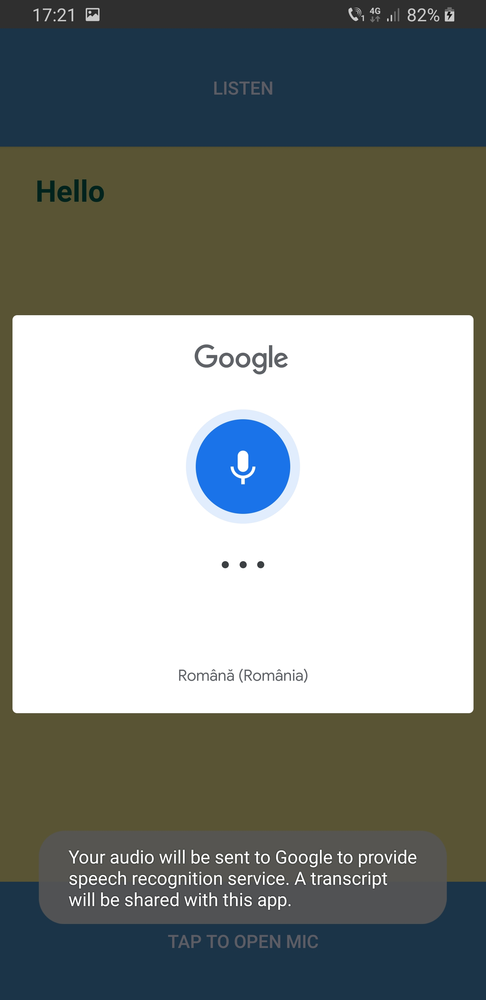
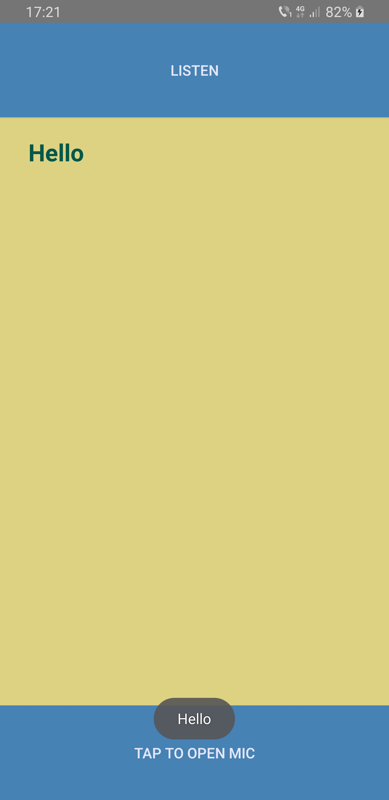

 # Lab7 ex1

* Android Fragments Example App
* In this application I followed the instructions from the link provided in the lab platform and also I followed some tutorials on the Internet on Fragments
* You can also find here below some screenshots from the application

