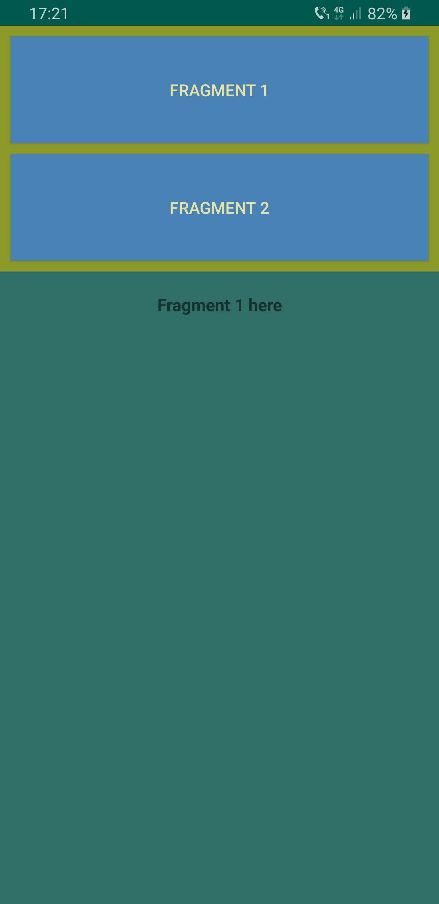

 # Lab7 ex2

* Text-To-Speech App
* In this application I followed the instructions from the lab platform and also I followed some tutorials on the Internet on Text-To-Speech
* You can also find here a video about how to use the application

