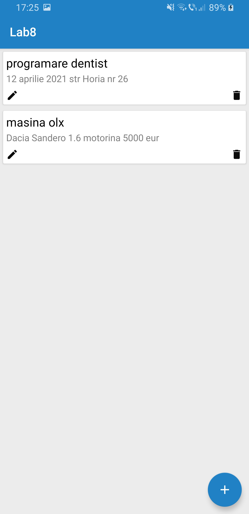
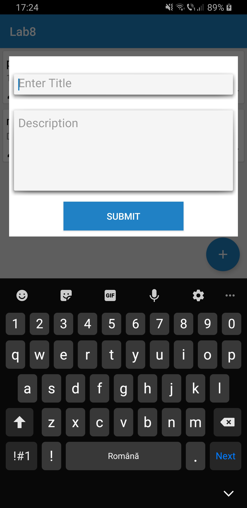

 # Lab8

* Android SQLite Example App
* SQLite is an open source database that is used to store data. It is a lightweight database that comes with Android OS.
* In this application I followed the instructions from the link provided in the lab platform and also I followed some tutorials on the Internet on SQlite, like this tutorial: https://www.11zon.com/android/android_sqlite.php
* You can also find a nice high quality short movie about how to use the application
* Here below you have some full-screen screenshots from the application

